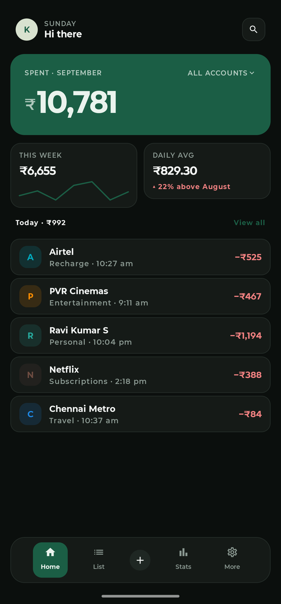
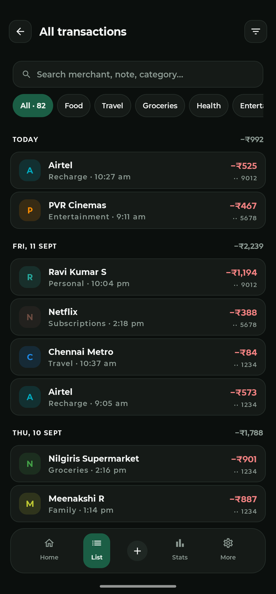
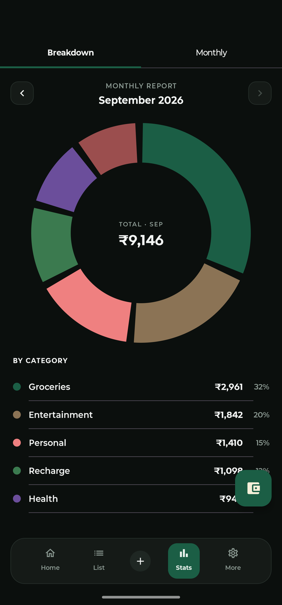

<div align="center">

<picture>
  <source media="(prefers-color-scheme: dark)" srcset="docs/assets/banner-dark.png">
  
</picture>

### Your phone already knows what you spent. Kaasu just writes it down.

A privacy-first expense tracker for India that reads the payment notifications and SMS your phone
already receives — and keeps every rupee of it on your device.

**No account. No cloud. No bank login. No ads.**

<sub>*kaasu* · **காசு** · Tamil for money</sub>

<br>

[](LICENSE)
[](#requirements)
[](https://kotlinlang.org)
[](https://developer.android.com/jetpack/compose)
[](../../actions)
[](../../releases/latest)

[Install](#-install) · [Features](#-what-it-does) · [Privacy](#-privacy-concretely) · [How it works](#️-how-it-works) · [Contributing](#-contributing)

</div>

---

## 🤔 Why this exists

Every expense tracker in India asks you to do one of two things:

1. **Type every purchase in by hand** — work you will quietly stop doing by week three.
2. **Hand over your bank credentials** to an aggregator — your entire financial history, on someone
   else's server, forever.

There's a third option nobody builds. Every UPI payment, card swipe and bank debit already arrives
on your phone as a notification or an SMS. **Kaasu reads those, on the device, and builds the log
for you.**

Nothing leaves your phone — there is no server for it to leave to.

---

## 📥 Install

### Option 1 — download the APK *(easiest)*

**[⬇️ Download the latest release](../../releases/latest)**

1. Grab `kaasu-x.y.z.apk` from the release page on your phone.
2. Open it. Android will ask you to allow installs from your browser or file manager — that prompt
   is normal for any app not from the Play Store.
3. Open Kaasu and finish onboarding.

<details>
<summary><b>Verify what you downloaded</b> — worth doing for an app that reads your bank messages</summary>

<br>

Kaasu is not on the Play Store, so no store listing vouches for a download. Two things do.

**1. The signing certificate — the durable identity.**

Every official release is signed by the same key. Android enforces this: an APK signed by any other
key *cannot* install as an update over a genuine Kaasu, it is refused outright. Anyone can rebuild
this source, but nobody else can produce this signature.

```
SHA-256  A2:86:82:47:92:E6:66:16:ED:51:EA:AD:4A:6B:BA:90:
         B6:19:BA:E7:70:C5:1B:32:3F:7C:51:B3:6E:51:41:C9
```

Check any APK against it before installing:

```bash
apksigner verify --print-certs kaasu-1.1.0.apk
# Signer #1 certificate SHA-256 digest: a286824792e66616ed51eaad4a6bba90b619bae770c51b323f7c51b36e5141c9
```

`apksigner` ships with the Android SDK build-tools. Without the SDK, `keytool -printcert -jarfile
kaasu-1.1.0.apk` prints the same fingerprint.

**2. The checksum — this exact file.**

Every release ships a `.sha256` next to the APK:

```bash
shasum -a 256 kaasu-1.1.0.apk    # compare with kaasu-1.1.0.apk.sha256
```

The APK is built by GitHub Actions from the tagged commit, so the run log shows exactly which source
produced it. Nothing is uploaded from anyone's laptop.

**3. Build provenance — where it was built.**

GitHub signs a statement that the APK came from this repository, this workflow and this commit,
which neither a checksum nor a signature can tell you:

```bash
gh attestation verify kaasu-1.1.0.apk --repo abdulhakeem19/kaasu
```

**Already installed?** Settings → About shows the signing key of the running build and whether it
matches. Read it against the fingerprint above.

One caveat, stated plainly: that in-app check is a convenience, not a guarantee. This source is
public, so a repackaged app could be altered to claim anything. The check that cannot be tampered
with is `apksigner`, run on the file **before** you install it.

</details>

### Option 2 — build it yourself

```bash
git clone https://github.com/abdulhakeem19/kaasu.git
cd kaasu/kaasu-android
./gradlew installDebug
```

Needs JDK 17 and Android Studio. A real device is strongly recommended — notification and SMS
capture can't be exercised on an emulator.

### Then, on the phone

| Step | What to do |
|:---:|---|
| **1** | Grant **notification access** when asked — this opens Android Settings, it isn't a normal popup |
| **2** | *Optional:* grant SMS access, then **Settings → Re-scan SMS inbox** to pull in past messages |
| **3** | *Optional:* **Settings → Re-scan saved transactions** to fill in anything captured earlier |

> **Requires Android 8.0 (API 26) or later.**

<details>
<summary><b>Other useful commands</b></summary>

<br>

```bash
./gradlew test                 # unit tests
./gradlew lint                 # Android lint
./gradlew assembleDebug        # build a debug APK
./gradlew connectedAndroidTest # instrumented tests (device required)
```

Cutting a release? See [docs/RELEASING.md](docs/RELEASING.md).

</details>

---

## ✨ What it does

|   | Feature | |
|:---:|---|---|
| 🔔 | **Four ways to capture** | Notification listener, direct SMS, statement import (CSV/PDF/XLSX), and an optional passive screen reader — all feeding one pipeline |
| 🏷️ | **Learns your categories** | Tag one "SWIGGY" by hand and every later one follows. Most-frequent wins, so one misfiling can't re-teach the wrong category |
| 🧾 | **Keeps your note** | The "Bike repair" you typed while paying in GPay lands on the transaction |
| 🔁 | **Kills duplicates** | The same payment arriving by notification *and* SMS is stored once |
| 🏦 | **Knows your banks** | IDFC, SBI, Union Bank and friends get a consistent colour and monogram |
| 📊 | **Budgets & insights** | Per-category budgets, subscription detection, a spending heatmap, CSV export |
| 🌙 | **Light and dark** | A proper near-black dark theme, not an inverted light one |
| 🔒 | **App lock** | Biometric or PIN, with amounts hidden on the lock screen |

---

## 📱 Screenshots

<div align="center">

| Dashboard | Transactions | Insights |
|:---:|:---:|:---:|
|  |  |  |

<sub>Sample data — not a real account.</sub>

</div>

---

## 🔐 Privacy, concretely

Most apps are vague here, so this is specific:

- 🚫 **Your data is never uploaded** — there is nowhere to upload it to.
- 🚫 **No analytics touch transaction content.** No merchants, amounts or notes are reported anywhere.
- 🚫 **Raw notification and SMS text is never logged in release builds.**
- ✅ **Deletion is real deletion** — a hard delete, not a hidden flag. Wipe everything from Settings.
- ✅ **Money is stored as integer paise**, never floating point, so totals don't drift.

### The permissions, and why

Kaasu asks for more than most trackers. You should know exactly why before granting anything:

| Permission | Why | Required |
|---|---|:---:|
| **Notification access** | Reads payment notifications — the main capture channel | ✅ Yes |
| **`RECEIVE_SMS` / `READ_SMS`** | Catches bank SMS for payments that send no notification | Optional |
| **Accessibility service** | Reads GPay's own history screen for payments the other channels missed | Optional, off by default |
| **`POST_NOTIFICATIONS`** | Budget alerts | Optional |

> ### ℹ️ About the screen-reading channel
>
> It reads Google Pay's own transaction-history screen for payments the other three channels never
> saw, and it is **off by default** — the other three cover most of what you spend.
>
> It only ever *adds*. Before storing a row it counts what is already recorded for that amount on
> that day, and each stored transaction absorbs one row from the screen, so only a genuine surplus
> is kept. That matters because each channel names the same payment differently — your bank's SMS
> names the account holder it paid, Google Pay names the shop — so matching on names alone would
> double-count every payment.

When it *is* enabled, it is deliberately the most conservative code in the project: **purely
passive** — it never taps, navigates or automates anything — and scoped statically to payment-app
packages and window-change events only, so it cannot observe PIN entry or arbitrary keystrokes.
Full reasoning in [`PERMISSION_STRATEGY.md`](docs/PERMISSION_STRATEGY.md).

> ### ℹ️ Kaasu is not on Google Play, and won't be
> Google Play restricts SMS and Accessibility permissions to apps whose *core function* requires
> them, and an expense tracker doesn't qualify. That's why Kaasu is distributed as an APK here
> instead.
>
> **Only install a Kaasu APK from [this repository's releases](../../releases).** An app with
> notification, SMS and accessibility access is worth attacking, and a build from anywhere else
> could contain anything. Check the published checksum — see [SECURITY.md](SECURITY.md).

---

## 🏗️ How it works

Every capture channel converges on one pipeline, so the parser, duplicate checker and categoriser
exist in exactly one place instead of once per channel:

```
  Notification ─┐
  SMS ──────────┤
  Statement ────┼──▶  TransactionCapturePipeline
  Screen read ──┘              │
                               ├─▶ TransactionParser      amount · type · merchant · note · confidence
                               ├─▶ DuplicateChecker       one payment, two channels → stored once
                               ├─▶ CategoryRuleEngine     explicit rules, then learned from history
                               └─▶ TransactionRepository  ──▶ Room (kaasu.db)
                                              │
                                              └──▶ UseCase ──▶ ViewModel ──▶ Compose UI
```

**Built with** Kotlin · Jetpack Compose · Material 3 · Room · DataStore · Hilt · Coroutines & Flow · WorkManager

<details>
<summary><b>Where the details live</b></summary>

<br>

| Document | What's in it |
|---|---|
| [`TECHNICAL_ARCHITECTURE.md`](docs/TECHNICAL_ARCHITECTURE.md) | Layer design and the parser pipeline |
| [`DATABASE_SCHEMA.md`](docs/DATABASE_SCHEMA.md) | Room entities, field by field |
| [`PERMISSION_STRATEGY.md`](docs/PERMISSION_STRATEGY.md) | Why each permission exists |
| [`ROADMAP.md`](docs/ROADMAP.md) | Where this is going |
| [`CHANGELOG.md`](CHANGELOG.md) | Every meaningful change since the first commit |

</details>

---

## 🤝 Contributing

Contributions are welcome — **parser coverage for banks Kaasu doesn't handle yet** is the single
highest-value thing you can add. Every bank words its messages differently, and Kaasu can only
categorise what it can read.

> ### ⚠️ Never commit a real bank message
> A real SMS carries your account tail, a reference number, and often **another person's name**.
> Change those before adding a test — keep only the bank's sentence structure, which is the only
> part the parser reads.

Start with [CONTRIBUTING.md](CONTRIBUTING.md) — it walks through adding a new bank step by step.

Found a security or privacy issue? Please **don't** open a public issue — see [SECURITY.md](SECURITY.md).

---

## 📄 License

[MIT](LICENSE) © 2026 Abdul Hakeem

<div align="center">
<br>
<picture>
  <source media="(prefers-color-scheme: dark)" srcset="docs/assets/logo-dark.png">
  
</picture>

<sub>Built in Chennai 🇮🇳</sub>

<sub>Kaasu is not affiliated with, endorsed by, or connected to any bank or payment provider.<br>
Bank names and colours are used only to identify your own accounts inside the app.</sub>

</div>
